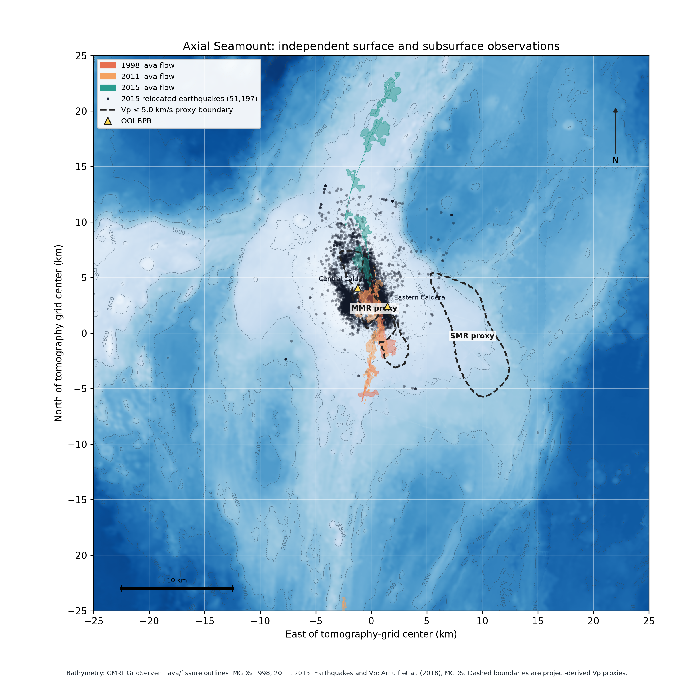

# Figure panel inventory and implementation record

This is the live record for all figures and caption-described panels in
Cabaniss et al. (2020) and its supplement. Written specifications and all six
supplementary figure captions have been extracted. The record makes no claim of
matching Cabaniss numerical results. Independent OOI observations cover part
of Fig. 2's time series from 2014 onward; raw historical BPR checks add
deployments from 1987 through 2022. Cabaniss numerical model panels are not
used for numerical comparison; project diagnostics are checked against written
methods and independent BPR observations. Published figure layout and style
may guide project presentation, and explicit rheology labels may be used to
map panels to configurations.

## Provenance rules

Allowed scientific specifications are written methods, rheology constraints,
and parameter descriptions in the paper, its supplementary materials, and
other model descriptions. Independent OOI and raw Axial BPR observations and
MGDS-documented tide/drift corrections are authorized. Published figures may
be consulted for visual style, layout, and explicit rheology-to-panel labels.
Do not use Cabaniss model outputs, author code, or plotting scripts. Do not
digitize, extract, or compare numerical model values, curves, failure fields,
or predicted times from published figures.

Independent OOI bottom-pressure-recorder (BPR) records, original raw BPR
channels from earlier Axial deployments, documented MGDS tide/drift
corrections, Axial bathymetry, earthquake catalogs, lava-flow outlines, and
MMR/SMR source records are authorized. These independent observations and
geological records remain permitted even when a paper cites the same records.
Cabaniss model-derived pressure or stress histories, eruption predictions,
plotted numerical values, failure fields, code, and figure files are excluded.
OOI's daily depth product covers Central and Eastern Caldera from 2014 onward
and retains its quality flags; historical BPR records provide event checks for
1998 and 2011. Use synthetic data only for software verification.

## Status definitions

| Status | Required evidence |
| --- | --- |
| Not implemented | No project-generated numerical panel exists, or a required written method or authorized input is unavailable, or the attempt failed. State which case applies. |
| Partially implemented | Project-generated data cover only part of the written quantity, time span, conditions, or spatial domain. Identify the coverage and gap. |
| Implemented | The documented written method and authorized inputs generate the project panel, and independent software or observation checks support its stated scope. This does not assert a match to Cabaniss model outputs. |
| Schematic | A conceptual redraw only. Label it as a schematic; it is not a numerical model result. |

The publisher's supplementary captions identify Figs. S1–S6 but do not provide
subpanel letters. The inventory records quantities named in those captions;
no supplementary panel mapping has been added from figure pages. Figure style
and explicit rheology labels may be consulted under the provenance rule above.

## Main article inventory

Commands shown as pending are not implemented yet. Replace them with exact,
working commands and output paths after each panel has a data generator and
plotting script. Record the configuration hash or revision alongside each run.

| Panel | Quantity and written specification | Data command | Plot command | Current status and independent validation record |
| --- | --- | --- | --- | --- |
| Fig. 1a | Regional bathymetry, 1998/2011/2015 lava-flow and fissure interpretations, 2015 relocated earthquakes, MMR/SMR outlines, and OOI BPR locations. | `python data/fetch_figure1_sources.py --download --accept-mgds-terms` → ignored `data/raw/figure1/`; checksum manifest `data/raw/figure1/manifest.json` | `make figure1-map` → `figures/figure1_axial_geologic_map.png` and `.pdf` | Partially implemented. The 50 km square project map uses GMRT bathymetry, MGDS flow/fissure records, all 51,197 Arnulf et al. earthquake locations, and Central/Eastern OOI BPR coordinates. MMR/SMR proxy contours use the independent Arnulf P-wave grid at 3.5 km below sea level, 0.2 km Gaussian smoothing, and a 5.0 km/s threshold. They do not reproduce the MMR migrated-section constraint or constitute official outlines; GMRT is a regional grid rather than the 1 m AUV mosaic. The catalog's geographic coordinates agree with its redundant local coordinates to <0.2 m RMS after projection. No Cabaniss model output or figure values were used. |
| Fig. 1b | Geological setting and model geometry, thermal/property slices, boundaries, and tectonic loading. Model schematic is separable from numerical results. | Written geometry and boundary specification | `make model-setup-schematic` → `figures/model_setup_schematic.png` | Schematic only. It shows the project-directed 50 km × 50 km × 10 km domain, pressurized 6 × 3 × 1 km ellipsoidal cavity, boundary labels, and unresolved tectonic face-rate split. The current PyLith runs still substitute a fixed base for the target Winkler foundation. |
| Fig. 2 | Center-BPR inflation/deflation history with eruption markers and earthquake counts. Caption identifies measured histories and event data. | `make bpr-observation-plot`; `make bpr-historical-check`; `make historical-generalized-maxwell-check`; `make historical-post-2011-bpr-check`; `make historical-post-2017-bpr-check`; `make historical-early-bpr-spatial-check`; `make historical-ooi-bpr-holdouts` | OOI: `figures/ooi_bpr_relative_uplift.png`; raw deployments: `figures/historical_bpr_deployment_context.png`; generalized Maxwell event and overlap checks: `figures/historical_generalized_maxwell_bpr_check.png`, `figures/historical_generalized_maxwell_deployment_bpr_check.png`, `figures/historical_generalized_maxwell_deployment_bpr_check_1995_2009.png`, `figures/historical_generalized_maxwell_deployment_bpr_check_2011_2017.png`, `figures/historical_generalized_maxwell_deployment_bpr_check_2018_2022.png`, `figures/historical_generalized_maxwell_2002_2004_bpr_check.png`, `figures/ooi_2017_2018_raw_bpr_holdouts.png` | Partial independent record. Original raw NCEI channels add deployments from 1987–2002 and MGDS channels add the 2002–04 Center deployment and further records through 2022; OOI covers 2014 onward. The 1987–1996 NCEI check adds three spatial holdouts. Generalized Maxwell checks cover ten paired windows from 1995–2022 plus the 1998/2011 eruption deployments; raw channels retain separate baselines, tides, ocean variability, and instrument drift, while compliance remains unconverged. The 2002–04 South holdout begins in September 2003. Six additional 2017–18 raw stations are checked against OOI Central with a static ellipsoid response; this comparison retains uncorrected tides and drift. The unstable 2017–18 Center channel is shown for context and excluded from model forcing. Earthquake counts, continuous inter-deployment histories, and the paper's model comparison are absent. No Cabaniss model outputs or published figure values were used. |
| Fig. 3 / four-case 4 × 4 property matrix | Four project rheologies by four rows: Young's modulus, viscosity, temperature, and thermal conductivity. Fields are the properties generated for PyLith input, not Cabaniss model outputs. | `make rheology-case-matrix` → ignored `data/processed/rheology_case_matrix_model_data.npz` and `rheology_case_matrix_summary.json` | `make figure3-rheology-properties` → `figures/figure3_rheology_property_matrix.png` and `.pdf` | Project-generated 2D center sections use the 50 km × 50 km × 10 km domain. The plot shows the right half-section by symmetry, with horizontal distance measured outward from the reservoir center (0–25 km). Temperature-dependent modulus uses the owner-directed 50-to-20 GPa linear interpolation; branch viscosities remain synthetic. The shared 1 MPa load and fixed base keep this a solver/property-map diagnostic, not a pressure calibration or eruption prediction. |
| Fig. 4a | Modeled reservoir overpressure histories calibrated against measured surface deformation; Cabaniss model curves and event predictions are excluded from project inputs and comparisons. | `make bpr-historical-check`; `make ellipsoid-bpr-check`; `make ellipsoid-mesh-sensitivity`; `make historical-bpr-maxwell-pressure-inversion`; `make historical-four-case-bpr-calibration`; `make historical-four-case-corrected-bpr-calibration`; `make ooi-maxwell-ellipsoid-check`; `make ooi-maxwell-pressure-inversion`; `make ooi-eq16-hydrothermal-maxwell-check`; `make ooi-maxwell-history-plot`; `make historical-generalized-maxwell-check`; `make historical-post-2011-bpr-check`; `make historical-post-2017-bpr-check`; `make historical-generalized-maxwell-1998-continuous-check`; `make historical-generalized-maxwell-2011-continuous-check` | Raw BPR context: `figures/historical_bpr_deployment_context.png`; generalized Maxwell event and deployment checks: `figures/historical_generalized_maxwell_bpr_check.png`, `figures/historical_generalized_maxwell_deployment_bpr_check.png`, `figures/historical_generalized_maxwell_deployment_bpr_check_1995_2009.png`, `figures/historical_generalized_maxwell_deployment_bpr_check_2011_2017.png`, `figures/historical_generalized_maxwell_deployment_bpr_check_2018_2022.png`, `figures/historical_generalized_maxwell_1998_continuous_bpr_check.png`, `figures/historical_generalized_maxwell_2011_continuous_bpr_check.png`; four-case raw calibration: `figures/historical_four_case_bpr_calibration_1998.png` and `figures/historical_four_case_bpr_calibration.png`; corrected fits: `figures/historical_four_case_bpr_calibration_1998_corrected.png` and `figures/historical_four_case_bpr_calibration_2011_corrected.png`; diagnostics under ignored `data/processed/axial_historical_bpr/` and `data/processed/`; `figures/historical_ellipsoid_deployment_checks.png`; `figures/ooi_maxwell_failure_history.png`; `figures/ooi_maxwell_viscoelastic_inversion.png`; `figures/historical_maxwell_pressure_inversion.png` | Partial independent pressure calibrations. Static, one-branch, and three-branch checks cover 1998/2011 events and raw deployments from 1987–2022; OOI covers 2014–2026. Four-case raw fits use WC81 Center/WC82A South in 1998 and NeMO Center/South in 2011. Center RMSE is 0.0926/0.1244 m; held-out South RMSE is 0.489–0.534/0.694–0.732 m. Both fits include eruption deflation and cannot independently predict timing. Corrected-observation fits have Center RMSE of 0.1154/0.1045 m and held-out South RMSE of 0.632–0.680/0.709–0.745 m. Other deployment checks retain separate baselines and yield South RMSE values from 0.043 to 1.242 m. Mesh-converged compliance, physical pressure scale, and a continuous cycle history remain unavailable. No Cabaniss model output or published figure value was used. |
| Fig. 4b | Modeled reservoir volume increase and observed deformation histories for eruption cycles. | `TBD: model and calibration command` | `TBD: figure script` | Not implemented. Requires documented calibration inputs; no curve digitization. |
| Fig. 5a | Failure slice; rheology label: non-TD elastic. | `make ellipsoid-failure-progression-smoke` for a two-year, constant-load threshold diagnostic | `TBD: figure script` | Not implemented. The smoke has no cavity-to-surface shear path, uses assumed rheology and boundary conditions, and does not generate the figure field. |
| Fig. 5b | Failure slice; rheology label: non-TD viscoelastic. | `TBD: model/failure command` | `TBD: figure script` | Not implemented. |
| Fig. 5c | Failure slice; rheology label: Stress + Full TD + Hydrothermal. | `TBD: model/failure command` | `TBD: figure script` | Not implemented. |
| Fig. 5d | Failure slice; rheology label: Full TD + Hydrothermal. | `TBD: model/failure command` | `TBD: figure script` | Not implemented. |
| Fig. 5e | Failure slice; rheology label: Full TD. | `TBD: model/failure command` | `TBD: figure script` | Not implemented. |
| Fig. 5f | Failure slice; rheology label: non-TD elastic. | `TBD: model/failure command` | `TBD: figure script` | Not implemented. |
| Fig. 5g | Failure slice; rheology label: non-TD viscoelastic. | `TBD: model/failure command` | `TBD: figure script` | Not implemented. |
| Fig. 5h | Failure slice; rheology label: Stress + Full TD + Hydrothermal. | `TBD: model/failure command` | `TBD: figure script` | Not implemented. |
| Fig. 5i | Failure slice; rheology label: Full TD + Hydrothermal. | `TBD: model/failure command` | `TBD: figure script` | Not implemented. |
| Fig. 5j | Failure slice; rheology label: Full TD. | `TBD: model/failure command` | `TBD: figure script` | Not implemented. |
| Fig. 5k | Failure slice; rheology label: non-TD elastic. | `TBD: model/failure command` | `TBD: figure script` | Not implemented. |
| Fig. 5l | Failure slice; rheology label: non-TD viscoelastic. | `TBD: model/failure command` | `TBD: figure script` | Not implemented. |
| Fig. 5m | Failure slice; rheology label: Stress + Full TD + Hydrothermal. | `TBD: model/failure command` | `TBD: figure script` | Not implemented. |
| Fig. 5n | Failure slice; rheology label: Full TD + Hydrothermal. | `TBD: model/failure command` | `TBD: figure script` | Not implemented. |
| Fig. 5o | Failure slice; rheology label: Full TD. | `TBD: model/failure command` | `TBD: figure script` | Not implemented. |
| Fig. 5p | Failure slice; rheology label: non-TD elastic. | `TBD: model/failure command` | `TBD: figure script` | Not implemented. |
| Fig. 5q | Failure slice; rheology label: non-TD viscoelastic. | `TBD: model/failure command` | `TBD: figure script` | Not implemented. |
| Fig. 5r | Failure slice; rheology label: Stress + Full TD + Hydrothermal. | `TBD: model/failure command` | `TBD: figure script` | Not implemented. |
| Fig. 5s | Failure slice; rheology label: Full TD + Hydrothermal. | `TBD: model/failure command` | `TBD: figure script` | Not implemented. |
| Fig. 5t | Failure slice; rheology label: Full TD. | `TBD: model/failure command` | `TBD: figure script` | Not implemented. |
| Fig. 6a–d | Four-stage conceptual mechanism diagram. This is not a numerical result. | Not applicable | `TBD: optional schematic script` | Schematic only if redrawn; label clearly and exclude from reproduction counts. |

**Figure 1a.** The 50 km square map overlays GMRT bathymetry, MGDS flow and fissure interpretations, the Arnulf et al. 2015 earthquake catalog, and OOI BPR locations. Small translucent seismicity markers keep the caldera and flow outlines visible. Central and Eastern Caldera labels use pale boxes and sit west and east of their markers; MMR and SMR proxy labels are shifted south. Dashed MMR/SMR traces show the project-derived 5.0 km/s contours at 3.5 km below sea level; they are proxies rather than official outlines. Source records: [1998 flow interpretation](https://doi.org/10.1594/IEDA/323601), [2011 flow interpretation](https://doi.org/10.1594/IEDA/324416), [2015 flow interpretation](https://doi.org/10.1594/IEDA/324418), [earthquake catalog](https://doi.org/10.1594/IEDA/324421), and [P-wave grid](https://doi.org/10.1594/IEDA/324420).

Figure 3's column headings explicitly identify its four rheology configurations;
the table rows above use those labels and property-row names without recording
plotted values. Figure 5's row headings map panels a/f/k/p to non-TD elastic,
b/g/l/q to non-TD viscoelastic, c/h/m/r to “Stress + Full TD + Hydrothermal,”
d/i/n/s to “Full TD + Hydrothermal,” and e/j/o/t to “Full TD.” TD means
temperature-dependent. The labels are transcribed from the row and column
headings in [Cabaniss et al. (2020), Figs. 3 and 5](https://doi.org/10.1038/s41598-020-67043-0).
These categorical labels and layouts may guide project panel mapping and
style; numerical fields, axes, forecast annotations, and model-predicted times
are excluded. Grouped rheology layouts, consistent slice framing, and distinct
failure-mode encodings may guide project figures, with results generated
independently.

## Supplementary inventory

The publisher-served supplement contains six figure captions. Its PDF pages
carry a “Confidential manuscript submitted” footer, so this transcription is
attributed to that publisher-served copy and may reflect a pre-publication
version. Supplementary figure pages and plotted data have not been inspected.

| Figure | Quantity and written specification | Data command | Plot command | Current status and independent validation record |
| --- | --- | --- | --- | --- |
| Supplementary Fig. S1 | Two-dimensional slices through the three-dimensional model space showing Young's modulus, viscosity, thermal gradient, and thermal conductivity for all four rheologies; the reservoir appears in the upper left of each slice. Subpanel letters are not given in the caption. | `make thermal-model` | `make thermal-property-slices` → `figures/thermal_property_slices.png` | Partially implemented for one hydrothermal temperature-dependent configuration on a y=0 finite-thickness slice. The other rheologies, full model slices, and exact panel layout remain unavailable; Eq. 16 is shown as printed and conflicts with its stated modulus limits. |
| Supplementary Fig. S2 | Effect of hydrothermal circulation on the location of the brittle–ductile transition. | `TBD: thermal-property model command` | `TBD: figure script` | Not implemented. Calculate transition depth and distance from the reservoir using the written thermal criteria and project temperature field. |
| Supplementary Fig. S3 | Benchmark compatibility among the Mogi elastic analytical solution, the Del Negro viscoelastic analytical solution, the Gregg et al. 2D FEM, and the Cabaniss et al. 3D FEM; also compares Winkler and roller base conditions. | `TBD: analytical and FEM benchmark command` | `TBD: figure script` | Not implemented. The comparison requires independently generated analytical and numerical results; author outputs and plotted values are excluded. |
| Supplementary Fig. S4 | Surface displacement response to Winkler-foundation spring stiffness compared with an elastic roller base; numerical model response values are excluded. | `make ellipsoid-base-depth-sensitivity` | No comparison plot | Not implemented. A 20/30/40 km fixed-base depth sweep gives nonmonotonic BPR compliance changes on nonnested meshes and does not establish convergence or equivalence to the Winkler foundation. |
| Supplementary Fig. S5 | Three-dimensional model setup: 30 °C/km background geotherm, 0 °C surface, 1200 °C reservoir boundary, steady-state thermal structure, Winkler base, roller sides, and opposing prescribed velocities representing 60 mm/year ridge extension. | Written geometry and boundary specification | `make model-setup-schematic` → `figures/model_setup_schematic.png` | Schematic only. The plot shows the project-directed 50 km × 50 km × 10 km domain, assumed side and basal geotherm, and unresolved per-face spreading split. The target Winkler base is labeled separately from the fixed-base PyLith run. The schematic does not reproduce the numerical thermal field. |
| Supplementary Fig. S6 | Reservoir overpressure required to reproduce deformation at the Center BPR for the tested reservoir geometries and rheologies. | `make ellipsoid-bpr-check`; `make ellipsoid-mesh-sensitivity` | `figures/ooi_ellipsoid_elastic_calibration.png` | Not implemented. Global and local refinements do not establish mesh-converged compliance; the tested rheologies and pre-2014 pressure history are not modeled. |

## Required record for each panel

When a panel is attempted, replace each pending field with:

1. the project quantity, units, domain, and time;
2. allowed source document, page/section/table, and parameter keys;
3. input provenance and whether any observational series is unavailable;
4. exact command that writes the numerical data and its saved output path;
5. exact command that plots those saved data and its output path;
6. software revision, configuration identifier, and validation checks;
7. current status, independent observation checks, discrepancies among project cases, and failed attempts.

The final LaTeX report will include this record. Every plotted numerical panel
must be traceable from a report figure to a plotting script, saved model output,
run configuration, and written scientific specification.
